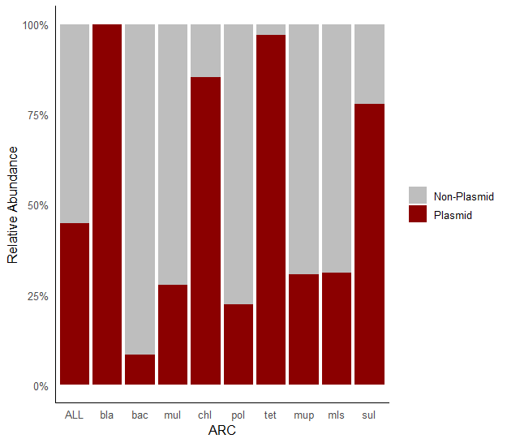
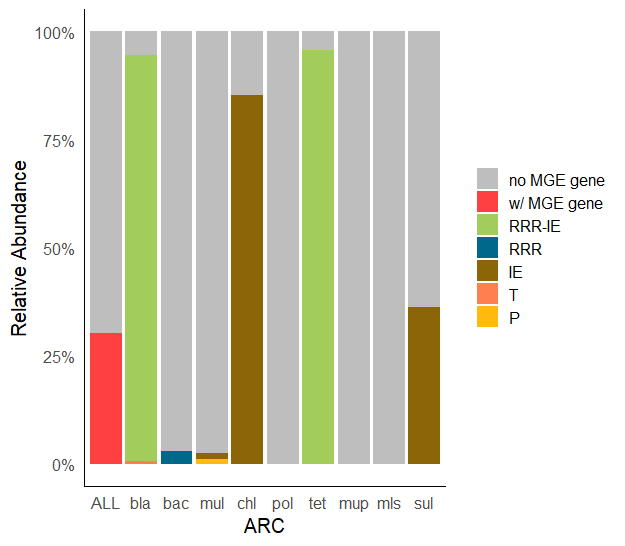

# ARC Profiling Workflow
## Assembly of short reads into contigs

The de novo assembly of clean, short reads into contigs was performed using **metaSPAdes (Galaxy Version 3.15.5+galaxy2)** on the [Galaxy EU platform](https://usegalaxy.eu/) using default parameters. Assemblies were generated individually for each sample. Assembled contigs were downloaded (sampleID_Contigs.fasta) and placed in the `contigs/` folder.

Contigs were filtered by length using **SeqKit v2.9.0**, retaining those ≥500 bp for downstream analyses. Contig statistics were also assessed before and after filtering.

```bash
# set input directory for contigs
input_dir="contigs"

# make output folder
mkdir -p contigs_500bp # contain filtered contigs
filtered_dir="contigs_500bp"

# make output stats files
output_stats="contigs_stats.txt"
filtered_stats="contigs_500bp_stats.txt"

# Initialize output stats files with headers
echo -e "sample\tfile\tformat\ttype\tnum_seqs\tsum_len\tmin_len\tavg_len\tmax_len\tQ1\tQ2\tQ3\tsum_gap\tN50\tN50_num\tQ20(%)\tQ30(%)\tAvgQual\tGC(%)\tsum_n" > "$output_stats"
echo -e "sample\tfile\tformat\ttype\tnum_seqs\tsum_len\tmin_len\tavg_len\tmax_len\tQ1\tQ2\tQ3\tsum_gap\tN50\tN50_num\tQ20(%)\tQ30(%)\tAvgQual\tGC(%)\tsum_n" > "$filtered_stats"

# Loop through all .fasta files
for fasta_file in "$input_dir"/*.fasta; do
    filename=$(basename "$fasta_file")
    sample="${filename%.*}"

    # Get stats for original file
    stats=$(seqkit stats -a "$fasta_file" | tail -n +2)
    echo -e "$sample\t$stats" >> "$output_stats"

    # Filter sequences >=500 bp
    filtered_file="$filtered_dir/${sample}_500bp.fasta"
    seqkit seq -m 500 "$fasta_file" -o "$filtered_file"

    # Get stats for filtered file
    filtered_stats_line=$(seqkit stats -a "$filtered_file" | tail -n +2)
    echo -e "${sample}_500bp\t$filtered_stats_line" >> "$filtered_stats"
done
```

The stats of the contigs and the filtered contigs are in `contigs_stats.txt` and `contigs_500bp_stats.txt`, respectively. Meanwhile `contigs_500bp/` contains the filtered contigs.

## Identification of ARCs
### Prediction of ORFs

Open reading frames (ORFs) within contigs were predicted using **Prodigal v2.6.3** in meta mode.

```bash
# set input directory for filtered contigs
input_dir="contigs_500bp"

# make output folder
mkdir -p predicted_ORFs
output_dir="predicted_ORFs"

# Loop through all .fasta files
for fasta_file in "$input_dir"/*.fasta; do

    filename=$(basename "$fasta_file")
    sample="${filename%%_*}" # get sample name

    echo "Processing: $sample"

    # Predict ORFs with Prodigal
    gff_file="$output_dir/${sample}_ORFs.gff"
    faa_file="$output_dir/${sample}_ORFs.faa"
    prodigal -i "$fasta_file" -o "$gff_file" -a "$faa_file" -p meta -q
done
```

The predicted ORFs are placed in the `predicted_ORFs/` folder.

### Alignment with SARG Database

The translated ORFs were aligned with the [SARG v3.2.1-S](https://smile.hku.hk/ARGs/dataset/indexingdownload/Short_subdatabase_V3.2.1.zip) database using **DIAMOND v2.1.11.165** with the BLASTP command, with cutoffs set at 10−7 e-value, 70% identity, and 70% query cover. A contig was considered an antibiotic-resistant contig (ARC) if it contained at least one ORF that matched to an ARG.

Download SARG Database then convert to DIAMOND format first:

```bash
diamond makedb --in "databases/SARG_v3.2.1-S/4.SARG_v3.2_20220917_Short_subdatabase.fasta" -d "databases/SARG_v3.2.1-S/SARG_v3.2.1-S"
```

Check `databases/SARG_v3.2.1-S/` for the *.dmnd* file. After which, perform alignment:

```bash
# set input directory for predicted ORFs
input_dir="predicted_ORFs"

# set database directory
db_dir="databases/SARG_v3.2.1-S/SARG_v3.2.1-S.dmnd"

# make output folder
mkdir -p Diamond_SARG_output
output_dir="Diamond_SARG_output"

# Loop through all .faa files
for faa_file in "$input_dir"/*.faa; do

    filename=$(basename "$faa_file")
    sample="${filename%%_*}" # get sample name

    echo "Processing: $sample"

    # Run DIAMOND
    diamond blastp \
        --query "$faa_file" \
        --db "$db_dir" \
        --out "${output_dir}/${sample}_dmnd_sarg.txt" \
        --outfmt 6 qseqid sseqid salltitles pident length mismatch gapopen qstart qend sstart send evalue bitscore \
        --evalue 1e-7 \
        --max-target-seqs 1 \
        --query-cover 70 \
        --id 70 \
        --threads 8
done
```

The alignments can be found in the `Diamond_SARG_output/` folder.

### Retrieval of ARCs

Get the contigs that have ARG hits. This was done through grep and seqkit:

```bash
# set input directories
faa_dir="predicted_ORFs"
fasta_dir="contigs_500bp"

# set filtering directory (ARG hits)
filter_dir="Diamond_SARG_output"

# make output folders
mkdir -p ARC_faa
out_faa="ARC_faa"
mkdir -p ARC_fasta
out_fasta="ARC_fasta"

# Loop through all .faa files
for faa_file in "$faa_dir"/*.faa; do

    filename=$(basename "$faa_file")
    sample="${filename%%_*}" # get sample name

    echo "Processing: $sample"
    
    # Define the filter .txt file path
    filter_file="${filter_dir}/${sample}_dmnd_sarg.txt"

    # Check if both the .txt and .faa files exist before processing
    if [[ -f "$filter_file" && -f "$faa_file" ]]; then
        grep -o 'NODE_[0-9]*_' "$filter_file" | uniq | \
        seqkit grep -nr -f - "$faa_file" > "$out_faa/${sample}_ARCs.faa"
        
        echo "Finished processing $sample."
    else
        # Show specific warnings for missing files
        [[ ! -f "$filter_file" ]] && echo "Warning: $filter_file not found in $filter_dir. Skipping $sample."
        [[ ! -f "$faa_file" ]] && echo "Warning: $faa_file not found in $faa_dir Skipping $sample."
    fi
done
echo "Done processing faa files"

# Loop through all .fasta files
for fasta_file in "$fasta_dir"/*.fasta; do

    filename=$(basename "$fasta_file")
    sample="${filename%%_*}" # get sample name

    echo "Processing: $sample"
    
    # Define the filter .txt file path
    filter_file="${filter_dir}/${sample}_dmnd_sarg.txt"

    # Check if both the .txt and .faa files exist before processing
    if [[ -f "$filter_file" && -f "$fasta_file" ]]; then
        grep -o 'NODE_[0-9]*_' "$filter_file" | uniq | \
        seqkit grep -nr -f - "$fasta_file" > "$out_fasta/${sample}_ARCs.fasta"
        
        echo "Finished processing $sample."
    else
        # Show specific warnings for missing files
        [[ ! -f "$filter_file" ]] && echo "Warning: $filter_file not found in $filter_dir. Skipping $sample."
        [[ ! -f "$fasta_file" ]] && echo "Warning: $fasta_file not found in $fasta_dir Skipping $sample."
    fi
done
echo "Done processing fasta files"
```

The output files are placed in `ARC_faa/` and `ARC_fasta/`.

The statistics of the ARCs was assessed using seqkit.

```bash
# set input directory for contigs
input_dir="ARC_fasta"

# make output stats files
output_stats="ARC_stats.txt"

# Initialize output stats files with headers
echo -e "sample\tfile\tformat\ttype\tnum_seqs\tsum_len\tmin_len\tavg_len\tmax_len\tQ1\tQ2\tQ3\tsum_gap\tN50\tN50_num\tQ20(%)\tQ30(%)\tAvgQual\tGC(%)\tsum_n" > "$output_stats"

# Loop through all .fasta files
for fasta_file in "$input_dir"/*.fasta; do
    filename=$(basename "$fasta_file")
    sample="${filename%.*}"

    # Get stats
    stats=$(seqkit stats -a "$fasta_file" | tail -n +2)
    echo -e "$sample\t$stats" >> "$output_stats"
done
```

The statistics of the ARCs can be found in `ARC_stats.txt`.

The separate fasta files were concatenated into one file for ease of use later. Sample names were appended on the fasta headers.

```bash
# set input and output directory
input_dir="ARC_fasta"
output_file="All_ARCs.fasta"

# create or empty the output file
> "$output_file"

# loop through each fasta file in ARC_fasta
for fasta_file in "$input_dir"/*.fasta; do

    filename=$(basename "$fasta_file")
    sample="${filename%%_*}" # get sample name
    
    # modify headers to include sample name, then append to output
    awk -v prefix="${sample}_" '/^>/{print ">" prefix substr($0,2)} !/^>/' "$fasta_file" >> "$output_file"
done

echo "All files combined into: $output_file"
```

The combined fasta file is named `All_ARCs.fasta`.

## Characterization of the Mobility of ARCs

The mobility of ARCs was based on plasmid-association and the presence of genes associated with mobile genetic elements (MGEs).

### Checking Plasmid-Association

Plasmid-association for the identified ARCs was predicted using **PlasFlow (Galaxy Version 1.1.0+galaxy0)** on the Galaxy EU server. The `All_ARCs.fasta` was uploaded and used for analysis. The output files were downloaded into the `Plasflow/` folder:

* ARCs_plasflow_prob_table.tabular - contains the classification per contig
* ARCs_plasflow_*.fasta - contains the sequences per corresponding classification

### Query for MGEs
DIAMOND alignment with the [MobileOG database v2.0.1-90 (pre-release)](https://zenodo.org/records/14725479) was performed to identify ARCs that harbor MGE-associated genes. These ARCs were classified as mobile ARCs.

Download the mobileOG database into the `databases` folder then convert to DIAMOND format:

```{bash, eval=FALSE}
diamond makedb --in "databases/mobileOG/mobileOGdb_90-2.0.fasta" -d "databases/mobileOG/mobileOGdb_90-2.0"
```

Check `databases/mobileOG/` for the *.dmnd* file. After which, perform alignment:

```bash
# set input directory for .faa files of ARCs
input_dir="ARC_faa"

# set database directory
db_dir="databases/mobileOG/mobileOGdb_90-2.0.dmnd"

# make output folder
mkdir -p Diamond_mobileOG_output
output_dir="Diamond_mobileOG_output"

# Loop through all .faa files
for faa_file in "$input_dir"/*.faa; do

    filename=$(basename "$faa_file")
    sample="${filename%.*}" # get sample name

    echo "Processing: $sample"

    # Run DIAMOND
    diamond blastp \
        --query "$faa_file" \
        --db "$db_dir" \
        --out "${output_dir}/${sample}_dmnd_mobileOG.txt" \
        --outfmt 6 qseqid sseqid salltitles pident length mismatch gapopen qstart qend sstart send evalue bitscore \
        --evalue 1e-7 \
        --max-target-seqs 1 \
        --query-cover 70 \
        --id 70 \
        --threads 8
done
```

The output files are in `Diamond_mobileOG_output/`.

## Quantification of ARCs

The clean short reads from each sample were individually mapped to the assembled contigs (>500 bp) using **BWA v0.7.19**. The resulting SAM files were processed using **SAMtools v1.3.1** for sorting into BAM files.

```bash
# Set input directories
assembly_dir="contigs_500bp"
shortread="clean_reads"

# set output folder
mkdir -p BWA_output
bwa_out="BWA_output"

# Loop through all .faa files
for fasta_file in "$assembly_dir"/*.fasta; do

    filename=$(basename "$fasta_file")
    sample="${filename%%_*}" # get sample name

    echo "============================================="\
    echo "Starting pipeline for $sample"
    start=$(date +%s)
    
    # index fasta file for alignment
    bwa index "$fasta_file"

    # Run BWA MEM and convert directly to sorted BAM
    echo "Running BWA MEM and sorting $sample..."
    bwa mem -t 4 "$fasta_file" \
      "${shortread}/${sample}_1_cleaned.fastq.gz" \
      "${shortread}/${sample}_2_cleaned.fastq.gz" | \
      samtools view -@ 4 -bS -F 4 | samtools sort -@ 4 -o "${bwa_out}/${sample}_500bpContigs_sorted.bam"
    
    if [[ $? -ne 0 ]]; then
      echo "Error during BWA/SAMtools for $sample. Exiting." >&2
      exit 1
    fi
  
    end=$(date +%s)
    runtime=$((end - start))
    echo "Pipeline complete for $sample (Runtime: ${runtime} seconds)"
    echo "============================================="
    
done
```

The resulting bam files can be found in the `BWA_output/` folder.

To get the coverage statistics using the bam files, we used the coverage command of **SAMtools v1.22.1**. This gives us the number of reads mapped to the contigs and can be used to assess contig quality.

```{bash, eval=FALSE}
# Define directory for bam files
bam_dir="BWA_output"

# make output folder
mkdir -p contig_coverage_stats
sam_out="contig_coverage_stats"

# Loop through all bam files
for bam_file in "$bam_dir"/*.bam; do

    filename=$(basename "$bam_file")
    sample="${filename%_sorted.bam}" # get sample name

    echo "============================================="\
    echo "Starting pipeline for $sample"
    start=$(date +%s)
    
    # Check coverage stats of contigs
    echo "Checking coverage stats..."
    samtools coverage "$bam_file" > "${sam_out}/${sample}_cov_stats.txt"
   
    end=$(date +%s)
    runtime=$((end - start))
    echo "Pipeline complete for $sample (Runtime: ${runtime} seconds)"
    echo "============================================="
    
done
```

The coverage statistics can be found in the `contig_coverage_stats/` folder.

The abundance of each ARC was then calculated using the following equation, normalized to cell number:

$$
\text{Abundance}=\frac{Ni_{\text{mappedreads}}\times{L}_{\text{reads}}/{L}_{\text{ARC}}}{N_{\text{cell}}}
$$

where $Ni_{\text{mapped reads}}$ is the number of reads mapped to an ARC, $L_{\text{reads}}$ is the length of the short reads, $L_{\text{ARC}}$ is the length of the ARC, and $N_{\text{cell}}$ is the estimated cell number for each sample, as determined in stage one of the ARGs-OAP pipeline. This equation was incorporated in the Rscript `ARC_quantification.R`.

We also downloaded the [MobileOG v1.6](https://mobileogdb.flsi.cloud.vt.edu/entries/database_download). The `mobileOG-db-beatrix-1.6-All.csv`, which contained the structure of the database, was copied to the `database/` folder for later use.

```r
# ARC_quantification.R
# Load necessary packages
library(dplyr)
library(tidyr)
library(tidyverse)
library(stringr)
library(scales)

# List of sample names
samples <- c("AUGLS01", "AUGLS05", "AUGLS16", "SEPLS01", "SEPLS05", "SEPLS16")

# Read pertinent files
SargDB <- read.delim("databases/SARG_v3.2.1-S/4.SARG_v3.2_20220917_Short_subdatabase_structure.txt", header = TRUE, stringsAsFactors = FALSE) # sarg database structure
ARGs_metadata <- read.delim("args-oap_output/metadata.txt", header = TRUE, stringsAsFactors = FALSE) # metadata from args-oap analysis
mobileOG1.6 <- read.delim(file = "databases/mobileOG/mobileOG-db-beatrix-1.6-All.csv", sep = ",") # mobileOG1.6 database structure
plasflow_prob <- read.delim("Plasflow/ARCs_plasflow_prob_table.tabular", header = TRUE, stringsAsFactors = FALSE) # plasflow probability table

#### Calculate abundance of ARCs
# extract data for ncell data
ncell_data <- ARGs_metadata[,-c(2,3)]
ncell_data$Sample <- sub("_.*", "", ARGs_metadata$Sample)
# Calculate overall ncell
overall_ncell <- sum(ncell_data$nCell)

# Function to read coverage stats and calculate ARC abundance for a sample file
getCoverageStats <- function(Sample) {
  # Read coverage stats
  cov_stats <- read.delim(paste0("contig_coverage_stats/", Sample, "_500bpContigs_cov_stats.txt"), header = TRUE, stringsAsFactors = FALSE)
  
  # Filter for ARCs
  ARC_hits <- read.delim(paste0("Diamond_SARG_output/", Sample, "_dmnd_sarg.txt"), header = FALSE, stringsAsFactors = FALSE) # read diamond hits with SARG db
  ARC_nodes <- unique(sub("_[^_]*$", "", ARC_hits[[1]]))        # get the unique ARCs
  ARC_stats <- cov_stats[cov_stats$X.rname %in% ARC_nodes, ]    # Only get stats of ARCs
  
  ARC_stats <- ARC_stats %>%
    rename(Contig_ID = X.rname) %>%   # Rename the column
    mutate(Sample = Sample) %>%       # Add the Sample column
    select(Sample, everything()) %>%  # Reorder to make Sample the first column
    mutate(Contig_ID = sub("^(([^_]*_[^_]*)).*", "\\1", Contig_ID)) %>%    # drop length and coverage in Contig_ID
    mutate(Contig_ID = paste0(Sample, "_", Contig_ID))                     # include sample name to Contig_ID
  
  # Calculate abundance
  ncell <- ncell_data[ncell_data$Sample==Sample, 2]                               # Get ncell for the sample
  ARC_stats$Abundance_cpc <- ARC_stats$numreads * 150 / ARC_stats$endpos / ncell  # formula for abundance of an ARC
  
  # clear row names
  rownames(ARC_stats) <- NULL
  
  return(ARC_stats)
}

# Apply the function to each sample and combine results
all_cov_stats <- do.call(rbind, lapply(samples, getCoverageStats)) # contains contig coverage statistics

#### Classify ARCs based on plasflow probability table
plasflow_classification <- plasflow_prob %>%
  mutate(
    Contig_ID = str_replace(contig_name, "^((?:[^_]+_){2}[^_]+).*", "\\1"),
    PlasFlow_classification = str_extract(label, "^[^\\.]+")
  ) %>%
  select(Contig_ID, PlasFlow_classification)

#### Annotate ARCs with their top ARG and MGE hits
# Function to Annotate ARCs with ARG and MGE hits
getARGMGEHits <- function(Sample) {
  
  # Read hits
  ARG_hits <- read.delim(paste0("Diamond_SARG_output/", Sample, "_dmnd_sarg.txt"), header = FALSE, stringsAsFactors = FALSE)              # read diamond hits with SARG db
  MGE_hits <- read.delim(paste0("Diamond_mobileOG_output/", Sample, "_ARCs_dmnd_mobileOG.txt"), header = FALSE, stringsAsFactors = FALSE) # read diamond hits with MobileOG db
  
  # Add column names
  colnames(ARG_hits) <- c("qseqid", "sseqid", "salltitles", "pident", "length", "mismatch", 
                      "gapopen", "qstart", "qend", "sstart", "send", "evalue", "bitscore")
  colnames(MGE_hits) <- c("qseqid", "sseqid", "salltitles", "pident", "length", "mismatch", 
                          "gapopen", "qstart", "qend", "sstart", "send", "evalue", "bitscore")
  
  ARG_hits <- ARG_hits %>%
    mutate(ORF = sub(".*_(\\d+)$", "\\1", qseqid)) %>%            # Add the ORF column
    mutate(database = "SARG") %>%                                 # Add the database column
    mutate(qseqid = sub("^(([^_]*_[^_]*)).*", "\\1", qseqid)) %>% # drop length and coverage in qseqid
    mutate(qseqid = paste0(Sample, "_", qseqid)) %>%              # include sample name to qseqid
    rename(Contig_ID = qseqid) %>%                                # Rename the column
    mutate(Sample = Sample) %>%                                   # Add the Sample column
    select(-salltitles) %>%                                       # Remove salltitles column
    select(Sample, Contig_ID, ORF, database, everything())        # Reorder columns
  
  MGE_hits <- MGE_hits %>%
    mutate(ORF = sub(".*_(\\d+)$", "\\1", qseqid)) %>%            # Add the ORF column
    mutate(database = "MobileOG") %>%                             # Add the database column
    mutate(qseqid = sub("^(([^_]*_[^_]*)).*", "\\1", qseqid)) %>% # drop length and coverage in qseqid
    mutate(qseqid = paste0(Sample, "_", qseqid)) %>%              # include sample name to qseqid
    rename(Contig_ID = qseqid) %>%                                # Rename the column
    mutate(Sample = Sample) %>%                                   # Add the Sample column
    select(-salltitles) %>%                                       # Remove salltitles column
    select(Sample, Contig_ID, ORF, database, everything())        # Reorder columns
  
  # Merge dataframes
  ARGMGE_hits <- rbind(ARG_hits, MGE_hits)
  
  # Sort rows
  ARGMGE_hits <- ARGMGE_hits %>%
    mutate(Contig_num = as.numeric(str_extract(Contig_ID, "(?<=NODE_)\\d+"))) %>%   # Add a sorting column
    arrange(Contig_num, ORF) %>%
    select(-Contig_num)   # remove sorting column

  # clear row names
  rownames(ARGMGE_hits) <- NULL
  
  return(ARGMGE_hits)
}

# Apply the function to each sample and combine results
ARC_ARGMGE_hits <- do.call(rbind, lapply(samples, getARGMGEHits)) # contains top Diamond hits (with SargDB and MobileOG) per ORF of ARCs

# Annotate hits per ORF based on sseqid
Annotated_ARCs_hits <- ARC_ARGMGE_hits %>% # contains annotation from the databases (ARG type and subtype, and MGE category)
  # Add ARG type and subtype using SargDB structure
  left_join(SargDB %>% select(`SARG.Seq.ID`, Type, Subtype),
            by = c("sseqid" = "SARG.Seq.ID")) %>%
  rename(ARG_type = Type, ARG_subtype = Subtype) %>%
  mutate(ARG_subtype = sapply(strsplit(ARG_subtype, "__"), `[`, 2)) %>%
  # Add MGE category using sseqid string
  mutate(MGE_category = if_else(
      database == "MobileOG",sapply(strsplit(sseqid, "\\|"), `[`, 4), NA_character_)) %>%
  # Use the mobileOG1.6 db structure file to annotate sseqids with no info
  mutate(sseqid_1 = if_else(
    database == "MobileOG" & is.na(MGE_category), sapply(strsplit(sseqid, "\\|"), `[`, 1), NA_character_)) %>%
  left_join(
    mobileOG1.6 %>% select(mobileOG.Entry.Name, Major.mobileOG.Category),
    by = c("sseqid_1" = "mobileOG.Entry.Name")
  ) %>%
  mutate(MGE_category = if_else(
    !is.na(Major.mobileOG.Category), Major.mobileOG.Category, MGE_category)) %>%
  select(-sseqid_1, -Major.mobileOG.Category)   # remove sseqid_1 and Major.mobileOG.Category columns

#### Abbreviate ARG types and MGE categories
# Define a named vector for ARG type abbreviations
arg_abbr <- c(
  tetracycline = "tet",
  beta_lactam = "bla",
  chloramphenicol = "chl",
  sulfonamide = "sul",
  multidrug = "mul",
  novobiocin = "nov",
  polymyxin = "pol",
  bacitracin = "bac",
  trimethoprim = "tri",
  `macrolide-lincosamide-streptogramin` = "mls",
  pleuromutilin_tiamulin = "plt",
  mupirocin = "mup",
  aminoglycoside = "ami",
  other_peptide_antibiotics = "opa"
)
# Define a named vector for MGE category abbreviations
mge_abbr <- c(
  "replication/recombination/repair" = "RRR",
  "integration/excision" = "IE",
  transfer = "T",
  phage = "P",
  "stability/transfer/defense" = "STD"
)

# get selected columns and abbreviate ARG types
ARCs_arg_abbr <- Annotated_ARCs_hits %>%
  filter(!is.na(ARG_type)) %>% # keep only the rows with ARG hits
  select(Contig_ID, ARG_type) %>% # Keep only selected columns
  mutate(ARG_type = recode(ARG_type, !!!arg_abbr)) %>% # Replace ARG_type with abbreviations
  # Collapse distinct ARG types per Contig_ID
  group_by(Contig_ID) %>%
  summarize(
    ARG_type = paste(unique(ARG_type), collapse = "-"),
    .groups = "drop"
  )

# get selected columns and abbreviate MGE categories
ARCs_mge_abbr <- Annotated_ARCs_hits %>%
  filter(!is.na(MGE_category)) %>% # keep only the rows with MGE hits
  select(Contig_ID, MGE_category) %>% # Keep only selected columns
  mutate(MGE_category = recode(MGE_category, !!!mge_abbr)) %>% # Replace MGE_category with abbreviations
  # Collapse distinct ARG types per Contig_ID
  group_by(Contig_ID) %>%
  summarize(
    MGE_category = paste(unique(MGE_category), collapse = "-"),
    .groups = "drop"
  )

#### Summarize ARCs annotation
# create table for abundance, ARG, MGE, plasflow classification
ARCs_summary <- all_cov_stats %>%
  select(Sample, Contig_ID, Abundance_cpc) %>% # keep pertinent columns
  left_join(ARCs_arg_abbr, by = "Contig_ID") %>%  # Add ARG type
  left_join(ARCs_mge_abbr, by = "Contig_ID") %>%  # Add MGE category
  left_join(plasflow_classification, by = "Contig_ID")  # Add PlasFlow classification

# List of ARCs with associated ARGs > 0.001 cpc based on ARGs-OAP quantification
arc_0.001 <- c("bla", "bac", "mul", "chl", "pol", "tet", "mup", "mls", "sul")

ARCs_summary_0.001 <- ARCs_summary %>%
  separate_rows(ARG_type, sep = "-") %>%    # Split multiple ARGs into rows
  filter(ARG_type %in% arc_0.001) %>%       # Keep only target ARGs using arc_0.001
  left_join(ncell_data, by = "Sample") %>%  # Add ncell values
  mutate(UN_cpc = Abundance_cpc*nCell)      # Compute unnormalized abundances
  
### Summarize plasmid association of ARCs
plasmid_summary <- ARCs_summary_0.001 %>%
  mutate(Plasmid_Status = ifelse(PlasFlow_classification == "plasmid", "Plasmid", "Non-Plasmid")) %>%   # Classify either as Plasmid or Non-Plasmid
  group_by(ARG_type, Plasmid_Status) %>%                          # Group rows by their ARG_type and Plasmid_Status
  summarise(Total_Abundance = sum(UN_cpc), .groups = "drop") %>%  # Calculate total unnormalized abundance
  group_by(ARG_type) %>%                                          # Group by ARG_type
  mutate(Relative_Abundance = Total_Abundance / sum(Total_Abundance)) # calculate relative abundance

# Calculate overall ratio of Plasmid vs Non-plasmid (not just for the selected ARGs)
plasmid_overall <- ARCs_summary  %>%
  left_join(ncell_data, by = "Sample") %>%  # Add ncell values
  mutate(Plasmid_Status = ifelse(PlasFlow_classification == "plasmid", "Plasmid", "Non-Plasmid")) %>%   # Classify either as Plasmid or Non-Plasmid
  mutate(UN_cpc = Abundance_cpc*nCell) %>%  # Compute unnormalized abundances
  group_by(Plasmid_Status) %>%              # Group by plasmid status
  summarise(Total_Abundance = sum(UN_cpc), .groups = "drop") %>%    # Calculate total unnormalized abundance
  mutate(ARG_type = "ALL") %>%              # Change ARG_type to "ALL"
  group_by(ARG_type) %>%              
  mutate(Relative_Abundance = Total_Abundance / sum(Total_Abundance)) # Calculate relative abundance

# Combine plasmid association by ARG type with overall
plasmid_combined <- bind_rows(plasmid_summary, plasmid_overall)

# Set order of factors
plasmid_combined$ARG_type <- factor(plasmid_combined$ARG_type,
                                               levels = c("ALL", "bla", "bac", "mul", "chl", "pol", "tet", "mup", "mls", "sul"))

# Plot
ggplot(plasmid_combined, aes(x = ARG_type, y = Relative_Abundance, fill = Plasmid_Status)) +
  geom_bar(stat = "identity", position = "stack") +
  labs(
    x = "ARC",
    y = "Relative Abundance"
  ) +
  geom_text(
    data = plasmid_combined %>% filter(Plasmid_Status == "noPlasmid"),
    aes(label = percent(Relative_Abundance, accuracy = 1)),
    position = position_stack(vjust = 0.5), # center of Plasmid segment
    color = "white",
    size = 3.5,
    family = "sans"
  ) +
  guides(fill = guide_legend(title = NULL)) +
  theme_minimal(base_family = "sans", base_size = 12) +
  scale_y_continuous(labels = scales::percent_format()) +
  theme(legend.position = "right", 
        panel.grid.major = element_blank(),
        panel.grid.minor = element_blank(),
        axis.line = element_line(color = "black"),
        panel.border = element_blank(),
        panel.background = element_blank())+
  scale_fill_manual(values = c("Plasmid" = "#8B0000", "Non-Plasmid" = "grey"))

### Summarize MGE association of ARCs
MGE_summary <- ARCs_summary_0.001 %>%
  mutate(MGE_category = ifelse(is.na(MGE_category), "no MGE gene", MGE_category)) %>%    # annotate ARCs with no MGE as no MGE gene
  group_by(ARG_type, MGE_category) %>%                          # Group rows by their ARG_type and MGE_category
  mutate(MGE_category = if_else(MGE_category == "IE-RRR", "RRR-IE", MGE_category)) %>%    # Reorder MGEs to match with others
  summarise(Total_Abundance = sum(UN_cpc), .groups = "drop") %>%  # Calculate total unnormalized abundance
  group_by(ARG_type) %>%                                          # Group by ARG_type
  mutate(Relative_Abundance = Total_Abundance / sum(Total_Abundance)) # calculate relative abundance

# Calculate overall ratio of Plasmid vs Non-plasmid (not just for the selected ARGs)
MGE_overall <- ARCs_summary  %>%
  left_join(ncell_data, by = "Sample") %>%  # Add ncell values
  mutate(MGE_category = ifelse(is.na(MGE_category), "no MGE gene", "w/ MGE gene")) %>%    # annotate ARCs with no MGE as no MGE gene
  mutate(UN_cpc = Abundance_cpc*nCell) %>%  # Compute unnormalized abundances
  mutate(ARG_type = "ALL") %>%              # Change ARG_type to "ALL"
  group_by(ARG_type, MGE_category) %>%
  summarise(Total_Abundance = sum(UN_cpc), .groups = "drop") %>%      # Compute total unnormalized abundances
  mutate(Relative_Abundance = Total_Abundance / sum(Total_Abundance)) # Compute relative abundance

# Combine MGE association by ARG type with overall
MGE_combined <- bind_rows(MGE_summary, MGE_overall)

# Set order of factors
MGE_combined$ARG_type <- factor(MGE_combined$ARG_type,
                                    levels = c("ALL", "bla", "bac", "mul", "chl", "pol", "tet", "mup", "mls", "sul"))

# Plot
MGE_colors <- c(
  "no MGE gene" = "grey",
  "w/ MGE gene" = "brown1",
  "RRR"         = "deepskyblue4",
  "RRR-IE"          = "darkolivegreen3",
  "T"          = "coral",
  "IE"        = "darkgoldenrod4",
  "P"          = "darkgoldenrod1"
)

MGE_combined <- MGE_combined %>%
  mutate(MGE_category = factor(MGE_category, levels = c(
    "no MGE gene", "w/ MGE gene", "RRR-IE", "RRR", "IE", "T", "P"))) # Set order of factors

ggplot(MGE_combined, aes(x = ARG_type, y = Relative_Abundance, fill = MGE_category)) +
  geom_bar(stat = "identity", position = "stack") +
  labs(
    x = "ARC",
    y = "Relative Abundance"
  ) +
  geom_text(
    data = MGE_combined %>% filter(MGE_category == "w/in MGE gene"),
    aes(label = percent(Relative_Abundance, accuracy = 1)),
    position = position_stack(vjust = 0.5),
    color = "white",
    size = 3.5,
    family = "sans"
  ) +
  guides(fill = guide_legend(title = NULL)) +
  theme_minimal(base_family = "sans", base_size = 12) +
  scale_y_continuous(labels = scales::percent_format()) +
  theme(legend.position = "right", 
        panel.grid.major = element_blank(),
        panel.grid.minor = element_blank(),
        axis.line = element_line(color = "black"),
        panel.border = element_blank(),
        panel.background = element_blank())+
  scale_fill_manual(values = MGE_colors)
```

`ARC_quantification.R` generates two stacked bar charts. The first one shows the relative abundance of mobile ARCs based on plasmid association:



The second chart shows the relative abundance of mobile ARCs based on the presence of MGE-related genes:



To output the tables for ARC profiling, the following codes were used:

```r
# out_ARC_tables.R
# Load necessary packages
library(xlsx)

# Create a new workbook
ARC_profiling_wb <- createWorkbook()

# Add first sheet
sheet1 <- createSheet(ARC_profiling_wb, sheetName = "ARC_Coverage_Stats")     # contains the coverage statistics of the ARCs
addDataFrame(all_cov_stats, sheet1, row.names = FALSE, col.names = TRUE)

# Add second sheet
sheet2 <- createSheet(ARC_profiling_wb, sheetName = "ARC_Profile_Summary")    # contains abundance (in cpc), ARGs, MGEs, and plasflow
                                                                              # classification of ARCs
addDataFrame(ARCs_summary, sheet2, row.names = FALSE, col.names = TRUE)

# Add third sheet
sheet3 <- createSheet(ARC_profiling_wb, sheetName = "ARG&MGE_hits")         # contains annotation from the databases (ARG type and subtype, and
                                                                            # MGE category)
addDataFrame(Annotated_ARCs_hits, sheet3, row.names = FALSE, col.names = TRUE)

# Add fourth sheet
sheet4 <- createSheet(ARC_profiling_wb, sheetName = "plasmid_ARCs")           # contains the relative abundance of ARCs classified as plasmid
addDataFrame(as.data.frame(plasmid_combined), sheet4, row.names = FALSE, col.names = TRUE)

# Add fifth sheet
sheet5 <- createSheet(ARC_profiling_wb, sheetName = "MGE_ARCs")               # contains the relative abundance of ARCs with MGEs
addDataFrame(as.data.frame(MGE_combined), sheet5, row.names = FALSE, col.names = TRUE)

# Save workbook
saveWorkbook(ARC_profiling_wb, "ARC_profiling_tables.xlsx")
```

The tables are in `ARC_profiling_tables.xlsx`.
