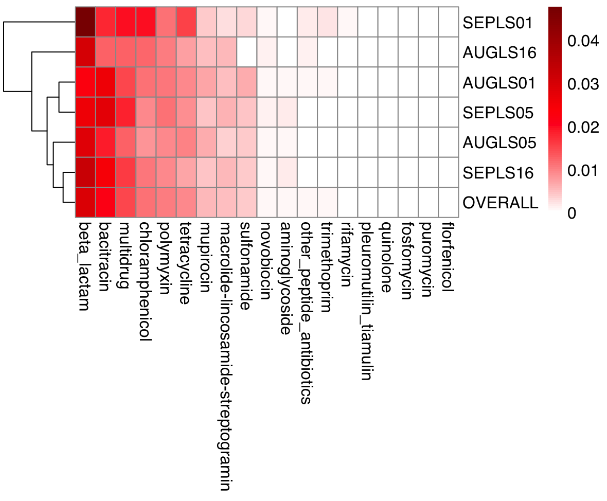
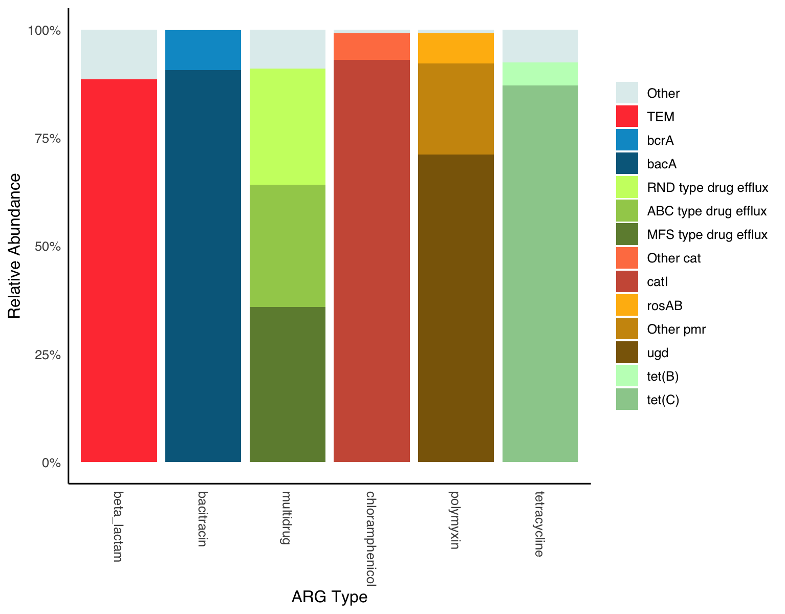

# laguna-lake-ARG-Analysis
Laguna Lake, the Philippines’ largest freshwater lake, has been found to contain antibiotic-resistant bacteria. However, information on antibiotic resistance genes (ARGs) remains limited. This study uses metagenomics to explore the diversity, prevalence, and mobility of ARGs in the lake’s West Bay.

# ARG Quantification Workflow
## Pre-processing of raw reads

Raw sequence reads found in the `raw_reads` folder were pre-processed using **Fastp v0.24.0** to trim adapter sequences, remove poly-G and poly-X tails, perform paired-end base correction, and filter reads based on quality (Phred >15):

```bash
# make output folders
mkdir -p clean_reads # contain cleaned reads
mkdir -p qc_report # contain quality control reports

# list of sample names
samples="AUGLS01 AUGLS05 AUGLS16 SEPLS01 SEPLS05 SEPLS16"

# perform fastp for each sample
for sample in $samples
do
  echo "Processing sample: $sample"

  fastp \
    -i raw_reads/${sample}_1.fastq.gz \
    -I raw_reads/${sample}_2.fastq.gz \
    -o clean_reads/${sample}_1_cleaned.fastq.gz \
    -O clean_reads/${sample}_2_cleaned.fastq.gz \
    --detect_adapter_for_pe \
    --trim_poly_g \
    --trim_poly_x \
    --correction \
    --qualified_quality_phred 15 \
    -j qc_report/${sample}.report.json \
    -h qc_report/${sample}.report.html \
    -w 8
done
```

The cleaned reads and quality reports are located in the `clean_reads` folder.

## ARG quantification via ARGs-OAP

Antibiotic resistance genes (ARGs) were detected and quantified using **ARGs-OAP v3.2.4**.

```bash
args_oap stage_one -i clean_reads -o args-oap_output -f fastq -t 8
args_oap stage_two -i args-oap_output -t 8
```

The `clean_reads` folder contains the clean reverse and forward reads of the samples. The `args-oap_output` folder contains the output files:

* metadata.txt - contains the estimated 16S and cell copy numbers in each sample
* normalized ARGs counts:
  * normalized_cell.type.txt - ARG type counts normalized against cell number
  * normalized_cell.subtype.txt - ARG subtype counts normalized against cell number
  * normalized_16S.type.txt - ARG type counts normalized against 16s copy number
  * normalized_16S.subtype.txt - ARG subtype counts normalized against 16s copy number

The abundance of each ARG type or subtype was calculated as the sum of all reads classified within the same category, normalized to the ARG reference sequence length and the estimated number of prokaryotic cells (see [(Yin et al., 2023)](https://doi.org/10.1016/j.eng.2022.10.011)):

<p align="center">
  
</p>

where $n$ is the number of ARGs belonging to the same category, $Ni_\text{mapped reads}$ is the number of reads mapped to an ARG, $L_\text{reads}$ is the length of the reads, $L_\text{ARG reference sequence}$ is the length of the reference ARG sequence, and  $N_\text{cell}$ is the cell number for each sample as calculated in stage one of the ARGs-OAP pipeline. The correction factor $k$ was introduced in v3.0 to account for ARG subtypes that utilize two- or three-component systems to encode functional resistance.

Additionally, the overall abundance of an ARG type was calculated as follows:

<p align="center">
  
</p>

where $\text{Overall}$ is the overall abundance of an ARG type or subtype across all samples, $Ni_\text{cell}$ is the cell number of a sample, and $\text{Abundance}i$ is the Abundance of an ARG type or subtype in the sample.

## ARG Profiling by type

The abundance profiles of ARG types normalized to cell number were summarized in a heatmap:

```r
# ARG_type_heatmap.R
# Load necessary packages
library(pheatmap)

#### Profiling by type; normalized to cell count
# Import args-oap output file: metadata.txt
args_oap_metadata <- read.table('args-oap_output/metadata.txt', header=TRUE, row.names=1)

# Import args-oap output file: normalized_cell.type.txt
normalized_cell.type <- as.data.frame(t(read.table('args-oap_output/normalized_cell.type.txt', row.names=1, header=TRUE)))
rownames(normalized_cell.type) <- sub("_.*", "", rownames(normalized_cell.type)) # Clean rownames

# Add OVERALL abundance row. OVERALL represents the cumulative abundance of ARG types from all samples normalized to the total cell copy number

overall <- c() # declare empty vector
for (i in 1:ncol(normalized_cell.type)) { # Loop over columns of normalized_cell.type
  value <- sum(args_oap_metadata[["nCell"]] * normalized_cell.type[[i]]) / 
    sum(args_oap_metadata[["nCell"]]) # Compute overall for column i
  overall <- c(overall, value) # Append to vector
}
ARG_type_df <- rbind(normalized_cell.type, OVERALL = overall) # add overall vector as new row

# Convert to matrix
ARG_type_mat <- as.matrix(ARG_type_df)

# Get last row index
overall_row <- nrow(ARG_type_mat)

# Reorder columns by values of last row (descending)
ARG_type_mat_ordered <- ARG_type_mat[, order(ARG_type_mat[overall_row, ], decreasing = TRUE)]

# Create heatmap with dendrogram
pheatmap(
  ARG_type_mat_ordered,
  scale = "none",
  cluster_rows = TRUE,
  cluster_cols = FALSE,
  color = colorRampPalette(c("white", "red", "darkred"))(100),
  fontsize = 12,
  fontsize_row = 12,
  fontsize_col = 12,
  fontfamily = "sans"
)

# Export ARG table
library(tibble)
ARG_type_transposed <- rownames_to_column(as.data.frame(t(ARG_type_df)), var = "Type") # for export to xlsx file
```

The generated heatmap is as shown below:



## ARG Profiling by subtype

For profiling by ARG subtype, we only considered relatively abundant ARG types (overall abundance > 0.009 cpc). Subtypes were also grouped arbitrarily prior to quantification, with groupings primarily based on [CARD](https://card.mcmaster.ca/) gene families. The data was visualized using a stacked bar chart. More details on these groupings can be found in the R script below.

```{r ARG_subtype_bars, eval=FALSE}
# Load necessary packages
library(tidyr)
library(dplyr)
library(ggplot2)

#### Profiling by subtype; normalized to cell count
# Import args-oap output file: metadata.txt
args_oap_metadata <- read.table('args-oap_output/metadata.txt', header=TRUE, row.names=1)

# Import args-oap output file: normalized_cell.subtype
normalized_cell.subtype <- as.data.frame(read.delim('args-oap_output/normalized_cell.subtype.txt', header=TRUE))
colnames(normalized_cell.subtype) <- sub("_.*", "", colnames(normalized_cell.subtype)) # Clean column names

# Separate type and subtype names
ARG_subtype_df <- normalized_cell.subtype %>%
  separate(col = subtype, into = c("Type", "Subtype"), sep = "__") %>%
  select(Type, Subtype, everything())

# Add OVERALL abundance column. OVERALL represents the cumulative abundance of ARG types from all samples normalized to the total cell copy number
ARG_subtype_df$OVERALL <- (ARG_subtype_df$AUGLS01*args_oap_metadata[[1, "nCell"]] +
                             ARG_subtype_df$AUGLS05*args_oap_metadata[[2, "nCell"]] +
                             ARG_subtype_df$AUGLS16*args_oap_metadata[[3, "nCell"]] +
                             ARG_subtype_df$SEPLS01*args_oap_metadata[[4, "nCell"]] +
                             ARG_subtype_df$SEPLS05*args_oap_metadata[[5, "nCell"]] +
                             ARG_subtype_df$SEPLS16*args_oap_metadata[[6, "nCell"]]
                            ) / sum(args_oap_metadata[["nCell"]])

# List of ARG types (overall abundance > 0.009 cpc). Check ARG_type_heatmap.R to see abundant ARG types.
Abundant_ARGs <- c("beta_lactam", "bacitracin", "multidrug", "chloramphenicol", "polymyxin", "tetracycline")
# Filter abundant ARG types
Abundant_ARGs_df <- ARG_subtype_df %>%
  filter(grepl(paste(Abundant_ARGs, collapse = "|"), Type)) %>%
  # Set order of ARG types
  mutate(Type = factor(Type, levels = c(
    "beta_lactam", "bacitracin", "multidrug", "chloramphenicol", "polymyxin", "tetracycline"
  )))


# Group ARGs based on subtypes and compute initial total abundance per subtype
Abundant_ARGs_grouped <- Abundant_ARGs_df %>%
  group_by(Type, Subtype) %>%
  summarise(Total_Abundance = sum(OVERALL), .groups = "drop") %>%
  group_by(Type) %>%
  mutate(
    Relative_Abundance = Total_Abundance / sum(Total_Abundance),
    subtype_substr = substr(Subtype, 1, 3)
    ) %>%
  # manually group subtypes based on ARG families in CARD (https://card.mcmaster.ca/)
  mutate(subtype_group = case_when(
    # for bacitracin resistance, keep subtypes as is since they are all from different gene families
    Type == "bacitracin" ~ Subtype,
    # for beta lactam resistance, the default grouping is the first 3 letters of the subtype (dropping the number)
    Type == "beta_lactam" & Subtype == "Escherichia coli ampC" ~ "ampC", # ampC-type beta-lactamase
    Type == "beta_lactam" & Subtype == "Klebsiella pneumoniae OmpK37" ~ "OmpK37",
    Type == "beta_lactam" & Subtype == "Other class A beta-lactamase" ~ Subtype,
    Type == "beta_lactam" & Subtype == "Other class C beta-lactamase" ~ Subtype,
    Type == "beta_lactam" ~ subtype_substr, # default for beta lactams
    # For multidrug resistance, subtypes are grouped based on major gene family
    Type == "multidrug" & Subtype == "Enterobacter cloacae acrA" ~ "RND type drug efflux",
    Type == "multidrug" & Subtype == "Escherichia coli acrA" ~ "RND type drug efflux",
    Type == "multidrug" & Subtype == "Escherichia coli emrE" ~ "SMR type drug efflux",
    Type == "multidrug" & Subtype == "Escherichia coli mdfA" ~ "MFS type drug efflux",
    Type == "multidrug" & subtype_substr == "Mex" ~ "RND type drug efflux",
    Type == "multidrug" & subtype_substr == "Mux" ~ "RND type drug efflux",
    Type == "multidrug" & subtype_substr == "Opm" ~ "RND type drug efflux",
    Type == "multidrug" & subtype_substr == "Opr" ~ "RND type drug efflux",
    Type == "multidrug" & subtype_substr == "Ran" ~ "ABC type drug efflux",
    Type == "multidrug" & Subtype == "abeM" ~ "MATE transporter",
    Type == "multidrug" & subtype_substr == "acr" ~ "RND type drug efflux",
    Type == "multidrug" & subtype_substr == "ade" ~ "RND type drug efflux",
    Type == "multidrug" & subtype_substr == "amr" ~ "RND type drug efflux",
    Type == "multidrug" & subtype_substr == "ceo" ~ "RND type drug efflux",
    Type == "multidrug" & subtype_substr == "efp" ~ "MFS type drug efflux",
    Type == "multidrug" & subtype_substr == "efr" ~ "ABC type drug efflux",
    Type == "multidrug" & subtype_substr == "eme" ~ "MATE transporter",
    Type == "multidrug" & subtype_substr == "emr" ~ "MFS type drug efflux",
    Type == "multidrug" & subtype_substr == "mds" ~ "RND type drug efflux",
    Type == "multidrug" & Subtype == "mdtE" ~ "RND type drug efflux",
    Type == "multidrug" & Subtype == "mdtF" ~ "RND type drug efflux",
    Type == "multidrug" & Subtype == "mdtH" ~ "MFS type drug efflux",
    Type == "multidrug" & Subtype == "mdtK" ~ "MATE transporter",
    Type == "multidrug" & subtype_substr == "mdt" ~ "MFS type drug efflux",
    Type == "multidrug" & subtype_substr == "mex" ~ "RND type drug efflux",
    Type == "multidrug" & subtype_substr == "msb" ~ "ABC type drug efflux",
    Type == "multidrug" & subtype_substr == "mtr" ~ "RND type drug efflux",
    Type == "multidrug" & subtype_substr == "oqx" ~ "RND type drug efflux",
    Type == "multidrug" & subtype_substr == "pmr" ~ "MFS type drug efflux",
    Type == "multidrug" & Subtype == "qacE" ~ "MFS type drug efflux",
    Type == "multidrug" & Subtype == "qacEdelta1" ~ "MFS type drug efflux",
    Type == "multidrug" & Subtype == "qacH" ~ "SMR type drug efflux",
    Type == "multidrug" & Subtype == "sdeY" ~ "RND type drug efflux",
    Type == "multidrug" & subtype_substr == "sme" ~ "RND type drug efflux",
    Type == "multidrug" & subtype_substr == "tap" ~ "MFS type drug efflux",
    # for chloramphenicol resistance, grouped based on gene family except for catI (~93% rel abundance)
    Type == "chloramphenicol" & Subtype == "catI" ~ "catI",
    Type == "chloramphenicol" & Subtype == "plasmid-encoded cat (pp-cat)" ~ "Other cat",
    Type == "chloramphenicol" & subtype_substr == "cat" ~ "Other cat", # default for cat except catI 
    Type == "chloramphenicol" & Subtype == "catI" ~ Subtype,
    Type == "chloramphenicol" & Subtype == "Salmonella enterica cmlA" ~ "cml",
    Type == "chloramphenicol" & subtype_substr == "cml" ~ subtype_substr,
    # for polymyxin resistance, most are pmr phosphoethanolamine transferase family.
    # but since ugd accounts for (~71%), it will be kept as is except for other pmr genes
    Type == "polymyxin" & Subtype == "arnA" ~ "Other pmr",
    Type == "polymyxin" & Subtype == "eptA" ~ "Other pmr",
    Type == "polymyxin" & Subtype == "pmrF" ~ "Other pmr",
    Type == "polymyxin" & subtype_substr == "mcr" ~ subtype_substr, # for mcr-5.1 and -5.2
    # for rosA and rosB, they will be considered as rosAB as they make up the two-component system
    Type == "polymyxin" & Subtype == "rosA" ~ "rosAB",
    Type == "polymyxin" & Subtype == "rosB" ~ "rosAB",
    # for tetracycline resistance, the subtypes are kept as is
    TRUE ~ Subtype # default for all others that are not renamed
  ))

# Compute abundance by subtype group
ARG_group_abundance <- Abundant_ARGs_grouped %>%
  group_by(Type, subtype_group) %>%
  summarise(Group_Abundance = sum(Total_Abundance), .groups = "drop") %>%
  group_by(Type) %>%
  mutate(Relative_Abundance = Group_Abundance / sum(Group_Abundance)) %>%
  # recategorize groups with < 5% abundance as Other 
  mutate(subtype_group = ifelse(Relative_Abundance < 0.05, "Other", subtype_group)) %>%
  group_by(Type, subtype_group) %>%
  summarise(Group_Abundance = sum(Group_Abundance), .groups = "drop") %>%
  group_by(Type) %>%
  mutate(Relative_Abundance = Group_Abundance / sum(Group_Abundance)) %>%
  # Reorder by ARG type and groups for stacked bar chart (Other on top, most abundant at the bottom)
  mutate(subtype_group = factor(subtype_group, levels = c(
    "Other",
    "TEM",
    "bcrA", "bacA",
    "RND type drug efflux", "ABC type drug efflux", "MFS type drug efflux",
    "Other cat", "catI",
    "rosAB", "Other pmr","ugd",
    "tet(B)", "tet(C)"
  )))

## plot
# set colors
group_colors <- c(
  "Other" = "azure2",
  "TEM" = "brown1",
  "bacA" = "deepskyblue4", "bcrA" = "deepskyblue3",
  "MFS type drug efflux" = "darkolivegreen4", "ABC type drug efflux" = "darkolivegreen3", "RND type drug efflux" = "darkolivegreen1",
  "catI"                 = "coral3", "Other cat" = "coral",
  "ugd" = "darkgoldenrod4", "Other pmr" = "darkgoldenrod3", "rosAB" = "darkgoldenrod1",
  "tet(C)" = "darkseagreen3", "tet(B)" = "darkseagreen1"
)

# create stacked bar chart
ggplot(ARG_group_abundance, aes(x = Type, y = Relative_Abundance, fill = subtype_group)) +
  geom_bar(stat = "identity", position = "stack") +
  labs(
    x = "ARG Type",
    y = "Relative Abundance"
  ) +
  guides(fill = guide_legend(title = NULL)) +
  theme_minimal(base_family = "sans", base_size = 12) +
  scale_y_continuous(labels = scales::percent_format()) +
  theme(legend.position = "right", 
        panel.grid.major = element_blank(),
        panel.grid.minor = element_blank(),
        axis.line = element_line(color = "black"),
        panel.border = element_blank(),
        axis.text.x = element_text(angle = -90, vjust = 0.5, hjust = 0),
        panel.background = element_blank())+
  scale_fill_manual(values = group_colors)
```

The generated stacked bar chart is shown below:



To output the abundance tables for ARG types and subtypes, the following codes were used:

```{r out_ARG_tables, eval=FALSE}
# Load necessary packages
library(xlsx)

# Create a new workbook
ARG_abundance_wb <- createWorkbook()

# Add first sheet
sheet1 <- createSheet(ARG_abundance_wb, sheetName = "ARG_Types")
addDataFrame(ARG_type_transposed, sheet1, row.names = FALSE, col.names = TRUE)

# Add second sheet
sheet2 <- createSheet(ARG_abundance_wb, sheetName = "ARG_Subtypes")
addDataFrame(ARG_subtype_df, sheet2, row.names = FALSE, col.names = TRUE)

# Save workbook
saveWorkbook(ARG_abundance_wb, "ARG_abundance_tables.xlsx")
```

The abundance tables are in *ARG_abundance_tables.xlsx*.
